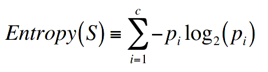
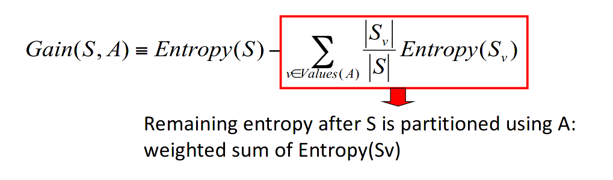

# Lecture 1 - Decision trees

## Representation

* Node tests a Attribute
* Brach corresponds to attribute value
* Leaf node assign a classification
* Each path is a conjunction of attribute value  

## Top down

* A <- Best attribute
* Assings a to next node
* For each value of A, create new descendant  of node
* Sort training examples to leaf nodes
* If training examples perfectly classified, then stop, else iterate over new leaf nodes

## Entropy

* S - Sample of training examples
* Entropy measures the impurity of S
* Entropy(S)≡−p+log2p+()−p−log2p−()where p_=1−p
* 
* Expected number of bits needed to class of drawn members
* optimal length code assigns –log2p bits to message having probability p

## Information Gain

* Gain (S, A) = expected reduction in entropy due to sorting on A

